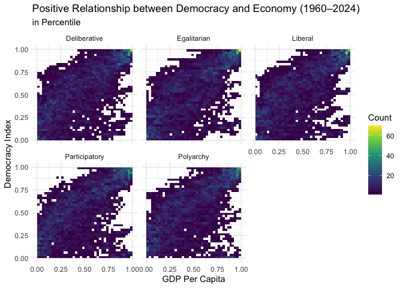

Project memo
================
Team name

This document should contain a detailed account of the data clean up for
your data and the design choices you are making for your plots. For
instance you will want to document choices you’ve made that were
intentional for your graphic, e.g. color you’ve chosen for the plot.
Think of this document as a code script someone can follow to reproduce
the data cleaning steps and graphics in your handout.

``` r
# install.packages(c("ggplot2", "gganimate", "sf", "dplyr", "viridis", "av"))
 #install.packages("WDI")
 #install.packages("countrycode")  
 library(WDI)
 library(countrycode)
library(tidyverse)
```

    ## Warning: package 'ggplot2' was built under R version 4.4.3

``` r
library(broom)
library(gganimate)
library(ggplot2)
library(dplyr)
library(rnaturalearth)
library(rnaturalearthdata)
library(sf)  
```

    ## Warning: package 'sf' was built under R version 4.4.3

``` r
library(skimr)
library(stringr)
library(RColorBrewer)
library(htmltools)
library(leafsync)
library(leaflet)
library(kableExtra)
library(av)
```

## Data Clean Up Steps for Overall Data

### Step 1:

In this project, we use Varieties of Democracy (V-Dem) dataset and World
Development Indicators (WDI) dataset of the World Bank. Because of the
size of V-Dem dataset, we had to merge both the dataset outside Posit.
The following shows how we do this. We then rename variables in our main
dataset df. Here, we observe variables and observations.

``` r
df <- read_csv("../data/vdem3.csv")
```

    ## Rows: 17290 Columns: 19
    ## ── Column specification ────────────────────────────────────────────────────────
    ## Delimiter: ","
    ## chr   (7): country_name, histname, country_text_id, country, iso3c, region, ...
    ## dbl  (11): year, country_id, v2x_polyarchy, v2x_libdem, v2x_partipdem, v2x_d...
    ## date  (1): historical_date
    ## 
    ## ℹ Use `spec()` to retrieve the full column specification for this data.
    ## ℹ Specify the column types or set `show_col_types = FALSE` to quiet this message.

``` r
vdem2 <- df %>% 
   select(country_name,
          histname,
          historical_date,
          year,
          country_text_id,
          country_id,
          v2x_polyarchy,
          v2x_libdem,
          v2x_partipdem,
          v2x_delibdem,
          v2x_egaldem) 
 
 data <- WDI(
   country = "all",
   indicator = c(
     "NY.GDP.PCAP.CD",  
     "NY.GDP.MKTP.CD",  
     "SP.POP.TOTL",     
     "SI.POV.GINI"     
   ),
  start = 1960,
   end = 2024,
   extra = TRUE   )
 
 WDI_data <- data %>%
   rename(
     gdp_per_capita = NY.GDP.PCAP.CD,
     gdp = NY.GDP.MKTP.CD,
     population = SP.POP.TOTL,
     gini = SI.POV.GINI,
     iso3c = iso3c,
     region = region,
     country_name = country
   ) %>%
   mutate(
     continent = countrycode(iso3c, origin = "iso3c", destination = "continent")
   ) %>%

   select(year, country_name, iso3c, gdp_per_capita, gdp, population, gini, region, continent)
```

    ## Warning: There was 1 warning in `mutate()`.
    ## ℹ In argument: `continent = countrycode(iso3c, origin = "iso3c", destination =
    ##   "continent")`.
    ## Caused by warning:
    ## ! Some values were not matched unambiguously: , AFE, AFW, ARB, CEB, CHI, CSS, EAP, EAR, EAS, ECA, ECS, EMU, EUU, FCS, HPC, IBD, IBT, IDA, IDB, IDX, LAC, LCN, LDC, LMY, LTE, MEA, MIC, MNA, NAC, OED, OSS, PRE, PSS, PST, SAS, SSA, SSF, SST, TEA, TEC, TLA, TMN, TSA, TSS, WLD, XKX

``` r
 df <- right_join(vdem2, WDI_data, by = c("country_name", "year"))
 
 df <- df %>% 
  rename(polyarchy = v2x_polyarchy, 
         libdem = v2x_libdem, 
         delibdem = v2x_delibdem,
         partidem = v2x_partipdem,
         egaldem = v2x_egaldem, 
         countryid = country_text_id,
         gdppc = gdp_per_capita
         )
 df %>% 
  glimpse()
```

    ## Rows: 17,290
    ## Columns: 18
    ## $ country_name    <chr> "Mexico", "Mexico", "Mexico", "Mexico", "Mexico", "Mex…
    ## $ histname        <chr> "United Mexican States", "United Mexican States", "Uni…
    ## $ historical_date <date> 1960-12-31, 1961-12-31, 1962-12-31, 1963-12-31, 1964-…
    ## $ year            <dbl> 1960, 1961, 1962, 1963, 1964, 1965, 1966, 1967, 1968, …
    ## $ countryid       <chr> "MEX", "MEX", "MEX", "MEX", "MEX", "MEX", "MEX", "MEX"…
    ## $ country_id      <dbl> 3, 3, 3, 3, 3, 3, 3, 3, 3, 3, 3, 3, 3, 3, 3, 3, 3, 3, …
    ## $ polyarchy       <dbl> 0.231, 0.232, 0.232, 0.232, 0.231, 0.231, 0.231, 0.236…
    ## $ libdem          <dbl> 0.106, 0.106, 0.106, 0.106, 0.105, 0.105, 0.105, 0.106…
    ## $ partidem        <dbl> 0.133, 0.133, 0.133, 0.133, 0.133, 0.134, 0.134, 0.135…
    ## $ delibdem        <dbl> 0.118, 0.119, 0.119, 0.119, 0.119, 0.118, 0.118, 0.120…
    ## $ egaldem         <dbl> 0.115, 0.118, 0.118, 0.118, 0.118, 0.119, 0.119, 0.120…
    ## $ iso3c           <chr> "MEX", "MEX", "MEX", "MEX", "MEX", "MEX", "MEX", "MEX"…
    ## $ gdppc           <dbl> 355.0752, 373.7122, 388.4567, 419.5521, 480.7042, 505.…
    ## $ gdp             <dbl> 13040000000, 14160000000, 15200000000, 16960000000, 20…
    ## $ population      <dbl> 36724615, 37890118, 39129200, 40424065, 41772049, 4317…
    ## $ gini            <dbl> NA, NA, NA, NA, NA, NA, NA, NA, NA, NA, NA, NA, NA, NA…
    ## $ region          <chr> "Latin America & Caribbean", "Latin America & Caribbea…
    ## $ continent       <chr> "Americas", "Americas", "Americas", "Americas", "Ameri…

### Step 2:

We plan to answer the research question using basic visualizations of
correlations without considering covariates. To do this we use the
following variables: `country`, `year`, `countryid`, `polyarchy`,
`libdem`, `partipdem`, `delibdem`, `egaldem`, `gdp`, `gdppc`,
`population`, `region`, `continent`, and `gini`.

Most of our analyses will include three main variables: `year`, the
measures of democracy (`polyarchy`, `libdem`, `partipdem`, `delibdem`,
`egaldem`), and measures of economic development (`gdppc` and `gini`).

To further illustrate this, we plan to use the following visualizations:

1.  Time-series Plot - This will shows how the measures of democracy
    (`polyarchy`, `libdem`, `partipdem`, `delibdem`, `egaldem`) and
    measures of economic development (`gdppc` and `gini`) evolved
    through time. In the same visualization, we will also include lines
    that describe any particular events that explains the increase or
    drop of both measures. We can also facet this to show how the
    relationship differs (if at all) with respect to `region`.

2.  Animated Maps - This is another way to show how the measures of
    democracy (`polyarchy`, `libdem`, `partipdem`, `delibdem`,
    `egaldem`) and measures of economic development (`gdppc` and `gini`)
    evolved through time while also considering the `country` in a map.

3.  Scatter Plot and Heatmaps- This plot is the most important of all.
    This finally shows the bivariate relationship between economic
    development and democracy. One way to show this is by transforming
    the x-axis to the percentile of countries’ economic development and
    y-axis to the percentile of countries in terms of a measure of
    democracy. We will then facet them in terms of the measures of
    democracy (`polyarchy`, `libdem`, `partipdem`, `delibdem`,
    `egaldem`). This transformation is necessary, because as you will
    see below, the distribution of the economic indicator is highly
    skewed (although we may also use the log function).

## Plots:

#### Data cleanup steps specific to plot 1

These data cleaning sections are optional and depend on if you have some
data cleaning steps specific to a particular plot

``` r
#df <- df %>% 
 # rename(polyarchy = v2x_polyarchy, 
  #       libdem = v2x_libdem, 
   #      delibdem = v2x_delibdem,
    #     partidem = v2x_partipdem,
     #    egaldem = v2x_egaldem, 
      #   countryid = country_text_id,
       #1  gdppc = gdp_per_capita)
```

#### Final Plot 1

This

``` r
df_year <- df %>%
  group_by(year) %>%
  summarise(
    Polyarchy = median(polyarchy, na.rm = TRUE),
    `Liberal Democracy` = median(libdem, na.rm = TRUE),
    `Deliberative Democracy` = median(delibdem, na.rm = TRUE),
    `Participatory Democracy` = median(partidem, na.rm = TRUE),
    `Egalitarian Democracy` = median(egaldem, na.rm = TRUE),
    `GDP Per Capita` = median(gdppc, na.rm = TRUE)
  )

df_long <- df_year %>%
  pivot_longer(
    cols = c(Polyarchy, `Liberal Democracy`, `Deliberative Democracy`, `Participatory Democracy`,  `Egalitarian Democracy`),
    names_to = "index",
    values_to = "value"
  )

df_long <- df_long %>%
  mutate(
    index = factor(
      index,
      levels = c(
        "Polyarchy",
        "Liberal Democracy",
        "Deliberative Democracy",
        "Participatory Democracy",
        "Egalitarian Democracy"
      )))


scale_factor <- max(df_year$`GDP Per Capita`, na.rm = TRUE) /
                max(df_long$value, na.rm = TRUE)

p1 <- ggplot(df_year, aes(x = year)) +
  geom_line(aes(y = `GDP Per Capita`, color = "GDP per capita"), size = 1.2) +
  geom_line(
    data = df_long,
    aes(y = value * scale_factor, color = index),
    size = 1.2
  ) +
  scale_y_continuous(
    name = "GDP per capita",
    sec.axis = sec_axis(~ . / scale_factor, name = "Democracy Indices")
  ) +
  labs(
    title = "Democracy and Economy (1960–2024)",
    x = "Year",
    color = "Variables",
    caption = "Source: V-Dem Dataset v13; World Bank World Development Indicators (GDP per capita) "
  ) +
  theme_minimal() +
  scale_color_viridis_d() +
  annotate("rect", 
  xmin = 1975, 
  xmax = 1990, 
  ymin = 0, 
  ymax = 8000, 
  alpha = 0.05, 
  fill = "#440154FF") +
   # geom_vline(xintercept = 1975, linetype = "dotted", color = "#440154FF") +
   # geom_vline(xintercept = 1990, linetype = "dotted", color = "#440154FF") +
   # geom_text(aes(x = 1966, y = 7000), 
   # label = "Third Wave \n Democratization", size = 3.5)
    geom_vline(xintercept = 1975, linetype = "dotted", color = "#440154FF") +
   geom_vline(xintercept = 1990, linetype = "dotted", color = "#440154FF") +
   annotate("text", 
         x = 1982, 
         y = 7000, 
         label = "Third Wave \n Democratization", 
         size = 3.2)
```

    ## Warning: Using `size` aesthetic for lines was deprecated in ggplot2 3.4.0.
    ## ℹ Please use `linewidth` instead.
    ## This warning is displayed once every 8 hours.
    ## Call `lifecycle::last_lifecycle_warnings()` to see where this warning was
    ## generated.

``` r
ggsave(filename = "plot_output/Democracy_vs_Economy.png", plot = p1, width = 6, height = 4)
```

### Plot 2: gdppc-across-time map and Liberal-democracy-across-time map

Since it take so much time to knit when generating mp4 files. We put the
output link overhere. See over here:
<https://drive.google.com/file/u/0/d/1QzBOESqxSqmxjJ7EiKZybSGOcYg-OGwN/view?usp=sharing&pli=1>

### Plot 3: Positive Relationship between Democracy and Economy (1960–2024)

``` r
df_percentiles <- df %>%
  mutate(
    `GDP Per Capita` = percent_rank(gdppc),
    Polyarchy = percent_rank(polyarchy), 
    Egalitarian = percent_rank(egaldem),
    Participatory = percent_rank(partidem),
    Liberal = percent_rank(libdem),
    Deliberative = percent_rank(delibdem)
  )

df_long <- df_percentiles %>%
  pivot_longer(
    cols = c(Polyarchy, Egalitarian, Participatory, Liberal, Deliberative),
    names_to = "metric",
    values_to = "percentile_value"
  )

p2 <- ggplot(df_long, aes(x = `GDP Per Capita`, y = percentile_value)) +
  geom_bin2d(bins = 40) +
  scale_fill_viridis_c() +
  facet_wrap(~ metric) +
  labs(
    y = "Democracy Index",
    title = "Positive Relationship between Democracy and Economy (1960–2024)",
    subtitle = "in Percentile",
    fill = "Count"
  ) +
  theme_minimal()

print(p2)
```

    ## Warning: Removed 43880 rows containing non-finite outside the scale range
    ## (`stat_bin2d()`).

<!-- -->

``` r
if(!dir.exists("output")) { dir.create("output") }

ggsave(filename = "output/Democracy_vs_Economy_Bin2d.png", 
       plot = p2, 
       width = 8, 
       height = 6)
```

    ## Warning: Removed 43880 rows containing non-finite outside the scale range
    ## (`stat_bin2d()`).
