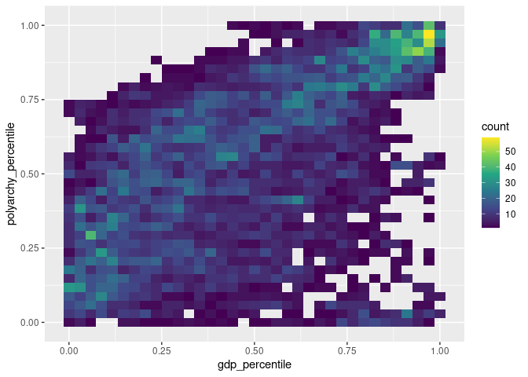
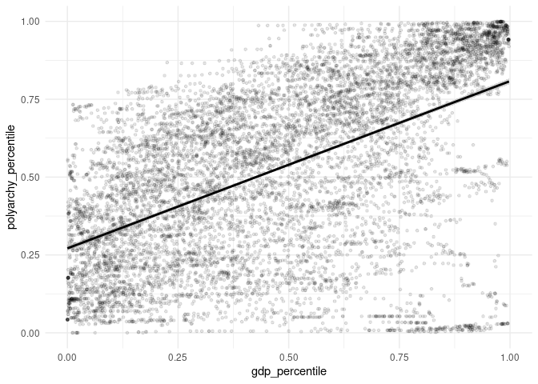

Project proposal
================
Fantastic 4 - RB, Keagan, Ian, Bravo

``` r
library(tidyverse)
library(broom)
# install.packages("skimr")
library(skimr)
library(stringr)
df <- read_csv("../data/vdem3.csv")
```

## 1. Introduction

This project deals with economy, democracy, and dictatorship.
Specifically, we inquire on the relationship between countries’ economy
and their regime. We ask how a country’s economy determines its regime
measured in democracy and dictatorship continuum. We further ask
specific questions:

1)  How does the region mediate the relationship?
2)  What historically relevant events one notices that affect both the
    economy and regime?
3)  Can it be that the regime determines the economy?

To answer these questions, we use regime and economic indicators
collected from the Varieties of Democracy (V-Dem) dataset and World
Development Indicators (WDI) dataset of the World Bank, respectively.
The V-Dem dataset provides us with five indices of democracy: polyarchy
(or electoral), egalitarian, deliberative, liberal, and participatory
democracy.

To supplement this, the WDI dataset provides economic indicators using
Gross Domestic Product per capita (GDP per capita). Finally, our working
dataset includes 181 countries and their three-letter ID spanning from
1960 to 2024, along with historically relevant events, their date, and
region. Thus, each observation is a country’s regime and economic data
in a given year.

## 2. Data

In this project, we use Varieties of Democracy (V-Dem) dataset and World
Development Indicators (WDI) dataset of the World Bank. Because of the
size of V-Dem dataset, we had to merge both the dataset outside Posit.
The following shows how we do this.

``` r
# vdem2 <- vdem %>% 
#   select(country_name,
#          histname,
#          historical_date,
#          year,
#          country_text_id,
#          country_id,
#          v2x_polyarchy,
#          v2x_libdem,
#          v2x_partipdem,
#          v2x_delibdem,
#          v2x_egaldem) 
# 
# install.packages("WDI")
# install.packages("countrycode")  
# library(WDI)
# library(countrycode)
# 
# data <- WDI(
#   country = "all",
#   indicator = c(
#     "NY.GDP.PCAP.CD",  
#     "NY.GDP.MKTP.CD",  
#     "SP.POP.TOTL",     
#     "SI.POV.GINI"     
#   ),
#   start = 1960,
#   end = 2024,
#   extra = TRUE  
# )
# 
# WDI_data <- data %>%
#   rename(
#     gdp_per_capita = NY.GDP.PCAP.CD,
#     gdp = NY.GDP.MKTP.CD,
#     population = SP.POP.TOTL,
#     gini = SI.POV.GINI,
#     iso3c = iso3c,
#     region = region
#   ) %>%
#   mutate(
#     continent = countrycode(iso3c, origin = "iso3c", destination = "continent")
#   ) %>%
#   select(year, country, iso3c, gdp_per_capita, gdp, population, gini, region, continent)
# 
# df <- right_join(vdem2, WDI_data, by = c("country_text_id", "year"))
```

We then rename variables in our main dataset df.

``` r
df <- df %>% 
  rename(polyarchy = v2x_polyarchy, 
         libdem = v2x_libdem, 
         delibdem = v2x_delibdem,
         partidem = v2x_partipdem,
         egaldem = v2x_egaldem, 
         countryid = country_text_id,
         gdppc = gdp_per_capita
         )
```

Here, we observe 19 variables and 17290 observations.

``` r
df %>% 
  glimpse()
```

    ## Rows: 17,290
    ## Columns: 19
    ## $ country_name    <chr> "Mexico", "Mexico", "Mexico", "Mexico", "Mexico", "Mex…
    ## $ histname        <chr> "United Mexican States", "United Mexican States", "Uni…
    ## $ historical_date <date> 1960-12-31, 1961-12-31, 1962-12-31, 1963-12-31, 1964-…
    ## $ year            <dbl> 1960, 1961, 1962, 1963, 1964, 1965, 1966, 1967, 1968, …
    ## $ countryid       <chr> "MEX", "MEX", "MEX", "MEX", "MEX", "MEX", "MEX", "MEX"…
    ## $ country_id      <dbl> 3, 3, 3, 3, 3, 3, 3, 3, 3, 3, 3, 3, 3, 3, 3, 3, 3, 3, …
    ## $ polyarchy       <dbl> 0.231, 0.232, 0.232, 0.232, 0.231, 0.231, 0.231, 0.236…
    ## $ libdem          <dbl> 0.106, 0.106, 0.106, 0.106, 0.105, 0.105, 0.105, 0.106…
    ## $ partidem        <dbl> 0.133, 0.133, 0.133, 0.133, 0.133, 0.134, 0.134, 0.135…
    ## $ delibdem        <dbl> 0.118, 0.119, 0.119, 0.119, 0.119, 0.118, 0.118, 0.120…
    ## $ egaldem         <dbl> 0.115, 0.118, 0.118, 0.118, 0.118, 0.119, 0.119, 0.120…
    ## $ country         <chr> "Mexico", "Mexico", "Mexico", "Mexico", "Mexico", "Mex…
    ## $ iso3c           <chr> "MEX", "MEX", "MEX", "MEX", "MEX", "MEX", "MEX", "MEX"…
    ## $ gdppc           <dbl> 355.0752, 373.7122, 388.4567, 419.5521, 480.7042, 505.…
    ## $ gdp             <dbl> 13040000000, 14160000000, 15200000000, 16960000000, 20…
    ## $ population      <dbl> 36724615, 37890118, 39129200, 40424065, 41772049, 4317…
    ## $ gini            <dbl> NA, NA, NA, NA, NA, NA, NA, NA, NA, NA, NA, NA, NA, NA…
    ## $ region          <chr> "Latin America & Caribbean", "Latin America & Caribbea…
    ## $ continent       <chr> "Americas", "Americas", "Americas", "Americas", "Ameri…

## 3. Data analysis plan

We plan to answer the research question using basic visualizations of
correlations without considering covariates. To do this we use the
following variables: `country`, `year`, `countryid`, `polyarchy`,
`libdem`, `partipdem`, `delibdem`, `egaldem`, `gdp`, `gdppc`,
`population`, `region`, `continent`, and `gini`.

Most of our analyses will include three main variables: `year`, the
measures of democracy (`polyarchy`, `libdem`, `partipdem`, `delibdem`,
`egaldem`), and measures of economic development (`gdppc` and `gini`).

To further illustrate this, we plan to use the following visualizations:

1.  Time-series Plot - This will shows how the measures of democracy
    (`polyarchy`, `libdem`, `partipdem`, `delibdem`, `egaldem`) and
    measures of economic development (`gdppc` and `gini`) evolved
    through time. In the same visualization, we will also include lines
    that describe any particular events that explains the increase or
    drop of both measures. We can also facet this to show how the
    relationship differs (if at all) with respect to `region`.

2.  Animated Maps - This is another way to show how the measures of
    democracy (`polyarchy`, `libdem`, `partipdem`, `delibdem`,
    `egaldem`) and measures of economic development (`gdppc` and `gini`)
    evolved through time while also considering the `country` in a map.

3.  Scatter Plot and Heatmaps- This plot is the most important of all.
    This finally shows the bivariate relationship between economic
    development and democracy. One way to show this is by transforming
    the x-axis to the percentile of countries’ economic development and
    y-axis to the percentile of countries in terms of a measure of
    democracy. We will then facet them in terms of the measures of
    democracy (`polyarchy`, `libdem`, `partipdem`, `delibdem`,
    `egaldem`). This transformation is necessary, because as you will
    see below, the distribution of the economic indicator is highly
    skewed (although we may also use the log function).

### Summary Statistics

``` r
df %>% 
  skim(libdem, delibdem, partidem, egaldem, gdppc, gdp, population, gini)
```

|                                                  |            |
|:-------------------------------------------------|:-----------|
| Name                                             | Piped data |
| Number of rows                                   | 17290      |
| Number of columns                                | 19         |
| \_\_\_\_\_\_\_\_\_\_\_\_\_\_\_\_\_\_\_\_\_\_\_   |            |
| Column type frequency:                           |            |
| numeric                                          | 8          |
| \_\_\_\_\_\_\_\_\_\_\_\_\_\_\_\_\_\_\_\_\_\_\_\_ |            |
| Group variables                                  | None       |

Data summary

**Variable type: numeric**

| skim_variable | n_missing | complete_rate | mean | sd | p0 | p25 | p50 | p75 | p100 | hist |
|:---|---:|---:|---:|---:|---:|---:|---:|---:|---:|:---|
| libdem | 6734 | 0.61 | 3.300000e-01 | 2.700000e-01 | 0.00 | 9.000000e-02 | 2.300000e-01 | 5.600000e-01 | 9.000000e-01 | ▇▃▂▂▃ |
| delibdem | 6650 | 0.62 | 3.200000e-01 | 2.700000e-01 | 0.00 | 8.000000e-02 | 2.400000e-01 | 5.600000e-01 | 8.900000e-01 | ▇▃▂▂▂ |
| partidem | 6692 | 0.61 | 2.600000e-01 | 2.100000e-01 | 0.01 | 8.000000e-02 | 1.800000e-01 | 4.300000e-01 | 8.100000e-01 | ▇▃▂▃▁ |
| egaldem | 6650 | 0.62 | 3.300000e-01 | 2.500000e-01 | 0.01 | 1.300000e-01 | 2.300000e-01 | 4.900000e-01 | 8.900000e-01 | ▇▅▂▂▃ |
| gdppc | 2749 | 0.84 | 8.656970e+03 | 1.741500e+04 | 11.80 | 5.821400e+02 | 1.927910e+03 | 8.045940e+03 | 2.565805e+05 | ▇▁▁▁▁ |
| gdp | 2749 | 0.84 | 1.231920e+12 | 5.703098e+12 | 2585955.87 | 2.359687e+09 | 1.759778e+10 | 2.081058e+11 | 1.112530e+14 | ▇▁▁▁▁ |
| population | 95 | 0.99 | 2.182403e+08 | 7.142245e+08 | 2715.00 | 1.019463e+06 | 6.790788e+06 | 4.706578e+07 | 8.142056e+09 | ▇▁▁▁▁ |
| gini | 14888 | 0.14 | 3.733000e+01 | 8.720000e+00 | 20.20 | 3.080000e+01 | 3.530000e+01 | 4.260000e+01 | 7.110000e+01 | ▅▇▃▂▁ |

### Preliminary Exploratory Data Analysis

Here, we try to visualize the relationship that directly answers our
main research question. As you may see, there’s a positive relationship
between `gdppc` and `polyarchy`, suggesting that at least in one
indicator of democracy, economy makes democracy (assuming that the
correlation is grounded in a sound theory).

``` r
df_percentiles <- df %>%
  mutate(
    gdp_percentile = percent_rank(gdppc),
    polyarchy_percentile = percent_rank(polyarchy)
  )

ggplot(df_percentiles, aes(x = gdp_percentile, y = polyarchy_percentile)) +
  geom_bin2d(bins = 35) +
  scale_fill_viridis_c() + 
  theme_gray()
```

    ## Warning: Removed 7583 rows containing non-finite outside the scale range
    ## (`stat_bin2d()`).

<!-- -->

``` r
ggplot(df_percentiles, aes(x = gdp_percentile, y = polyarchy_percentile)) +
  geom_point(alpha = 0.1, size = 1) +
  geom_smooth(method = lm, color = "black") +
  theme_minimal() 
```

    ## `geom_smooth()` using formula = 'y ~ x'

    ## Warning: Removed 7583 rows containing non-finite outside the scale range
    ## (`stat_smooth()`).

    ## Warning: Removed 7583 rows containing missing values or values outside the scale range
    ## (`geom_point()`).

<!-- -->

``` r
ggplot(df_percentiles, aes(x = gdp_percentile, y = polyarchy_percentile, color = region)) +
  geom_point(alpha = 0.5, size = 1) +
  geom_smooth(method = lm) +
  theme_minimal() +
  scale_color_viridis_d()
```

    ## `geom_smooth()` using formula = 'y ~ x'

    ## Warning: Removed 7583 rows containing non-finite outside the scale range
    ## (`stat_smooth()`).

    ## Warning: Removed 7648 rows containing missing values or values outside the scale range
    ## (`geom_point()`).

<!-- --> We decide
not to start on items 1 and 2, because it requires special knowledge of
additional packages not covered in class. However, we are currently
studying how to do them.
